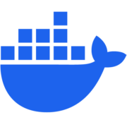
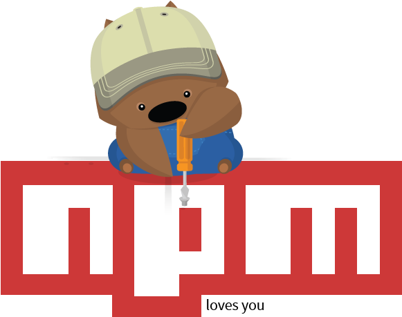
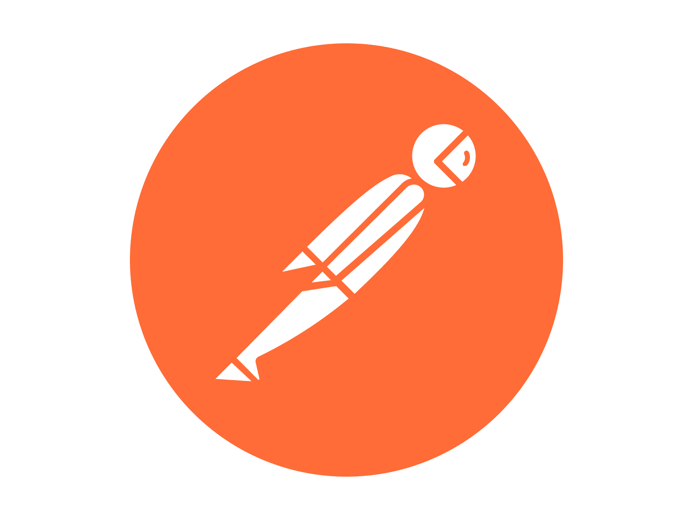
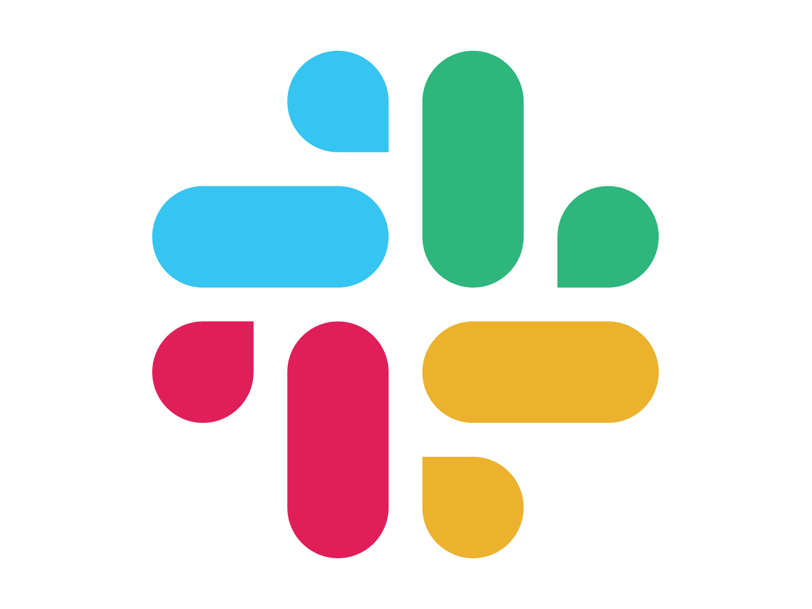

# 🌟 Fahad's QA Portfolio

Welcome to my Software Quality Assurance (SQA) portfolio!

👋 I’m a detail-oriented <b>QA Engineer</b> , currently working as a Lead QA at DQ , with <b> 3 + years of hands-on experience </b> in both <b> manual </b>and <b>automation </b>testing of web and mobile applications. 

   
Skilled in designing test strategies, writing comprehensive test cases,documenting detailed bug reports and executing automated tests to validate functionality, performance, and reliability using industry-standard tools (Playwright / Cypress / Selenium). Proficient in testing RESTful APIs with Postman and experienced in integrating automated tests into CI/CD pipelines using GitLab CI and GitHub Actions, leveraging DevOps practices and close collaboration with DevOps teams to streamline CI/CD processes.  

Furthermore, I am equipped with strong analytical skills, a solid understanding of STLC/SDLC, and hands-on experience with Agile methodologies 📈. My ability to collaborate effectively across teams ensures that stakeholders, developers, and QA remain aligned 🤝, while my focus on continuous improvement enables me to optimize testing processes, identify critical bugs, and drive high-quality, reliable product releases 🚀 .

✨ This portfolio showcases practical projects that reflect my hands-on approach, problem-solving mindset, and commitment to delivering reliable software quality across web, API, and mobile applications.

## 📌 Quick Links

- [How to Explore](#-how-to-explore)
- [Projects](#-projects)
- [Skills Demonstrated](#%EF%B8%8F-skills-demonstrated)
- [Contact](#-contact)

---

## 📂 How to Explore

- Open each project folder to view detailed **READMEs, test cases, documentation, and workflows**.
- Explore the **testing approach, methodology, and reasoning** behind each project.
- Review **sample test reports, bug logs, and analysis summaries** to understand the quality of work.
- No local setup is required — projects are showcase-only and focus on **process, thinking, and QA practices**.

---

## 🚀 Projects

1. **AI Voice Assistant App Full Scope QA**

   - Comprehensive QA of AI Voice Assistant platform covering **manual testing**, **automated test execution**, and **performance benchmarking**.
   - Automated **end-to-end UI flows** (login, assistants management, settings, dashboard, etc..) using **Playwright** with 97%+ test pass rate.
   - Achieved **50% reduction** in manual testing time and **85% early bug detection** through systematic test automation.  
     [🔎 Explore Full Project](https://github.com/fr0ntm4n001/Project-Full-Scope-QA)

##

_More projects coming soon..._

---

## 🛠️ Skills Demonstrated

**Tools ,Frameworks & Languages:**

  <!-- Development Tools -->
  
  

  
  
  
  
  
  
  <!-- Testing & Programming -->
  
  
  
  
  
  
  
  
  <!-- Slack -->
  

 

**Testing Types & Practices:**

- ✅ Functional Testing & Test Case Design
- 📝 Test Planning, Reporting & Documentation
- 🐞 Bug Reproduction with detailed logs
- 🔗 API Testing & Validation
- ⚡ Performance & Load Testing
- 📱 Mobile App Testing
- 🔄 CI/CD Integration (Automated test execution in pipelines)

---

## 📬 Contact

  <!-- LinkedIn -->
   &nbsp;
  
  &nbsp;&nbsp;
  <!-- Gmail -->
  

## 📄 License

Proprietary License. See [LICENSE](License) for details.
